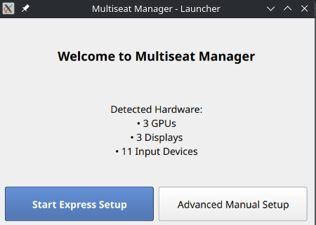
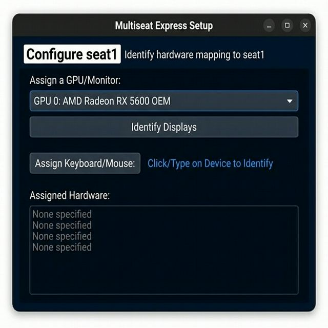
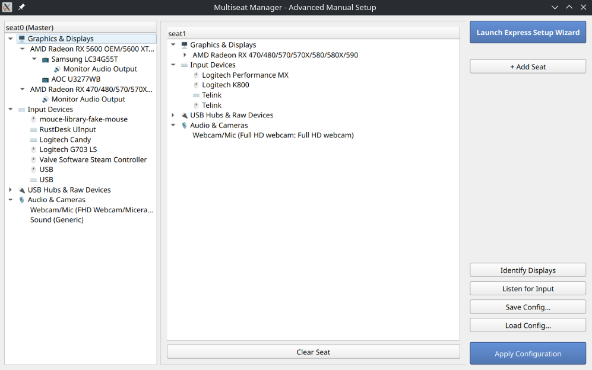

# Multiseat Manager

Multiseat Manager is a graphical Qt desktop application for Linux that provides an intuitive interface for managing `systemd-loginctl` device assignments. It allows you to easily map GPUs, monitors, USB hubs, and input devices to specific seats to create multi-monitor, multi-user environments on a single physical machine.

> [!NOTE]
> This application is currently in an early state and has only been tested on **Ubuntu 25.10**. While we hope it is useful for other distributions, please use with caution and report any issues.

## Features

- **Rootless GUI:** The main interface runs unprivileged, only prompting for `pkexec` authorization when absolutely necessary (e.g., listening for raw `/dev/input/` events or applying structural changes).
- **Express Setup Wizard:** A simple step-by-step wizard to quickly assign a monitor, keyboard, and mouse to a new seat.
- **Advanced Manual Setup:** A powerful drag-and-drop tree interface for intricate USB and PCI mapping.
- **Review Before Apply:** All generated configurations are staged locally in the app directory for your review as `udev` rules and a batch shell script before committing them to your system.
- **Save & Load:** Export complex hardware topologies to simple JSON files and restore them dynamically.

## Screenshots

### Launcher


### Express Setup Wizard


### Advanced Manual Setup


## Installation

### Standalone Binary Installation (Recommended)
You can download the compiled standalone generic Linux binary (`multiseat-manager-v1.0.0-linux.tar.gz`) from the [Releases](https://github.com/scamiran149/multiseat-manager/releases) page. It does not require installing Python packages.

1. Extract the release archive: `tar -xvf multiseat-manager-v1.0.0-linux.tar.gz`
2. Run the system-wide application installer (requires elevation to write to `/opt/`):
```bash
cd multiseat-manager && sudo ./install.sh
```

### From Source
1. Clone the repository: `git clone https://github.com/scamiran149/multiseat-manager.git`
2. Run the bootstrapper: `./launch.sh` 
*(This will automatically configure a python virtual environment, install dependencies, and launch the UI.)*

## Review Workflow

For safety, **Multiseat Manager** never modifies your live system state immediately.
When you click **Apply Configuration**, the tool generates the following in a local `staging/` directory:
1. `apply_config.sh`: Precise `loginctl attach` commands specifically diffed against your current session.
2. `70-multiseat-manager.rules`: Heavily commented persistent `udev` device rules matching your assignments.

A review dialog will appear allowing you to inspect these exact files before firing off `pkexec` to install them into `/etc/udev/rules.d/`.

## Legal
Licensed under the MIT License.
